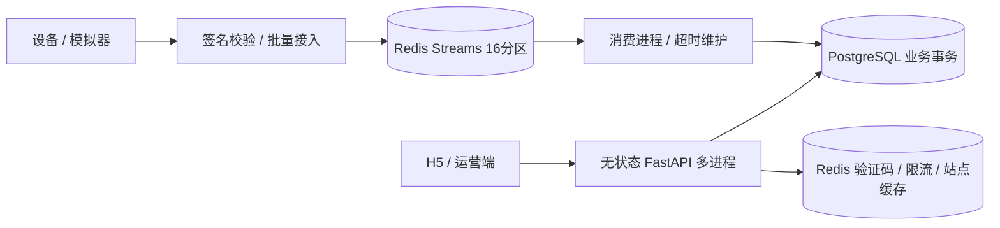

# 后端实现与并发设计

## 进程和存储



API、后台任务、设备模拟器分开运行。数据库连接池大小可配置，设置连接等待、行锁等待和 SQL 执行超时；部署 API 副本时需要一起核算 PostgreSQL 总连接预算。默认 API 两个进程，Docker 配置四个进程。

## 一致性规则

- 同一用户的资金、积分、充电操作以用户行锁串行化；开始充电还锁定车辆、桩和站点。数据库部分唯一索引保证一桩一会话、一用户一会话、一桩一有效预约、一用户一有效预约以及一用户一个默认车辆。
- 一个会话只生成一个订单、一个订单只生成一笔支付、一个售后只生成一笔退款，由数据库唯一约束兜底。支付重试返回文档规定的 `44002`；重复驶离返回原订单。
- 优惠券模板行锁保护总库存和限领检查；兑换积分、发券、流水、消息在同一事务。订单支付时再次校验归属、有效期、门槛和券状态。
- 退款锁住原订单，累计退款不得超过实付金额；返券前检查该券仍关联当前订单，防止它已返还并被另一个订单使用时再次返还。
- 预约超时扣分在同一事务更新 `credit_penalty_applied`。欠费任务清空处理过的 `overdue_at` 作为一次性处理标记，保留扣分流水。每日恢复由用户行锁及当天流水共同防重。
- 空闲提醒发送消息和 `ACTIVE -> NOTIFIED` 在同一事务完成。释放接口最多同步处理100条订阅，后台通过持久化订阅继续扫描补发，并用 `SKIP LOCKED` 分批竞争任务，避免热门站点的通知无限延长结束充电事务。
- 用户消息只软删除。管理员关键写操作保存修改前后快照及失败业务操作，密码、Token 等安全字段不会进入审计快照。

## 计费

金额使用 Decimal，最终金额按分四舍五入；数据库使用 NUMERIC，不使用浮点累加金额。每次启动冻结分时价格、占桩费规则和电池容量快照，不因后来改价变化。

遥测使用累计电量和递增序号。在相邻上报时刻之间按电量均匀分布假设分摊，遇电价边界和跨午夜会拆段；这一假设适用于没有更细电表曲线的模拟协议。达到目标电量时按区间比例插值计算到达时间，并自动停止。正式电表接入可替换该分摊模型。

充电结束后仍占用设备，驶离后生成消费订单并释放设备。占桩费不足一分钟按一分钟，超出免费期后按两级价格收费；达到规则封顶金额后不再增加。

V1.1 的支付和订单枚举没有独立的部分退款状态，因此全额及部分退款均使用 `REFUNDED`；实际退款比例、金额和剩余可退金额以 `refund_record` 为准。余额仍允许另行申请售后。

## 设备接入和恢复

`POST /api/v1/device/telemetry` 接受 `{ "events": [...] }`，每批1–1000条，每个事件包含：

```json
{
  "pileId": 1,
  "sessionId": 1,
  "sequence": 100,
  "energyKwh": "3.25",
  "powerKw": "120",
  "observedAt": "2026-09-16T12:00:00+08:00",
  "signature": "hex-hmac-sha256"
}
```

签名见 `telemetry.sign()`：以服务端根密钥和桩ID派生每桩密钥，再签名 `pileId|sessionId|sequence|energyKwh|powerKw|observedAt`。设备只需 provision 自己的派生密钥，不应拿到根密钥。超过5分钟的请求、坏签名和非有限数值会拒绝。

可选 `faultReason` 上报设备故障；填写时在签名原文末尾追加 `|faultReason`。消费者保存最后读数后异常停止会话，将设备置为 `FAULT` 并通知用户。异常充电不会发放正常完成充电的10积分及信誉奖励。

按桩ID对16取模分区；Lua 原子检查批次涉及的所有队列，单分区最多约10万条未完成数据，满载返回503要求重试，不裁剪未确认消息。Worker 在数据库提交后才 ACK 并删除消息；重复消费依靠会话计量序号丢弃重复/旧数据。

Worker 用 XAUTOCLAIM 认领超过30秒未处理的 pending 消息。瞬时失败最多重试5次，确定的格式/业务错误直接进入死信流；死信最多保留1万条，需由运维导出排查。可以给不同 Worker 设置 `WORKER_PARTITIONS=0,1,2,3` 等分片范围，增大独立消费并行度。

Compose 中 Redis 开启 AOF everysec，因此极端主机崩溃可能损失最后约1秒的 Redis 写入；已入 PostgreSQL 的账务不受此影响。生产设备需保存未确认读数并重传，需要更强接入持久性时应配置同步持久化/副本确认或替换持久消息系统。本机 WSL Redis 由系统现有配置管理。

## 查询与扩容边界

- 站点列表由 SQL 聚合桩状态，按实际经纬度计算球面距离；支持城市、设备类型、状态、距离/价格排序，以及前端参考要求的关键字、最大距离、价格、空闲筛选。
- 用户站点列表按查询条件缓存2秒，返回数据最多有2秒延迟；扫码、开始充电、预约和支付始终访问数据库进行状态核验。Redis 故障时返回可重试的503，避免无界回源。
- 常用关联、状态、用户流水和时间查询有组合索引；列表分页限制100条，统计最多366天，热点更新不采用应用进程内锁。
- 本轮实现可多进程/多实例运行，但单 PostgreSQL、单 Redis、统计即时聚合、库存计数查询和单事件事务消费仍有吞吐上限。全国规模部署需要根据真实压测结果进一步规划数据库分片/读副本、专用缓存与队列集群、设备批写、统计预聚合和运维容量，不能凭代码结构认定达到目标QPS。

实现参考：[SQLAlchemy PostgreSQL 行锁](https://docs.sqlalchemy.org/en/20/core/selectable.html)、[Redis Streams](https://redis.io/docs/latest/develop/data-types/streams/)、[XAUTOCLAIM](https://redis.io/docs/latest/commands/xautoclaim/)。
