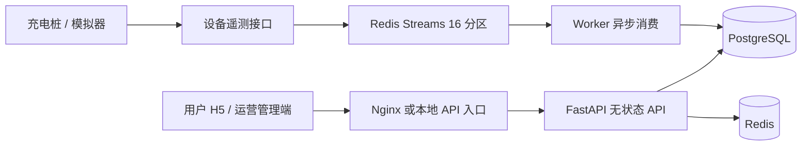

# 前端接入架构说明

这份文档只保留前端接入所需的信息：服务边界、请求约定、核心业务链路和本地联调方式。具体字段、枚举和业务码以运行中的 [OpenAPI](http://localhost:8080/openapi.json) 为准。

## 1. 服务拓扑



- 浏览器只访问 HTTP API，不直接访问 PostgreSQL、Redis 或设备队列。
- 用户请求和运营请求共用后端，但路径、Token 和权限域不同。
- 设备遥测是异步链路；页面通过查询接口获取会话、桩状态和费用，不依赖 WebSocket。
- API、Worker、设备模拟器是独立进程。设备消息先进入 Redis 分区队列，Worker 成功提交数据库事务后确认消息。

## 2. 前端连接方式

### 地址和认证

本地默认值：

```text
API_BASE_URL = http://localhost:8080
用户端       /api/v1/app
管理端       /api/v1/admin
```

登录接口不需要 Token。登录成功后保存 `data.accessToken`，其余需要登录的请求携带：

```http
Authorization: Bearer <accessToken>
Content-Type: application/json
```

Token 失效、账号锁定或权限不足时，根据 HTTP 状态码和 `code` 统一处理登录跳转、无权限提示和重试提示。后端允许的跨域开发地址默认是 `http://localhost:3000` 和 `http://localhost:5173`。

### 响应结构

```json
{
  "code": 0,
  "message": "success",
  "data": {},
  "timestamp": "2026-09-16T12:00:00+08:00"
}
```

- `code === 0` 表示业务成功。
- 数据字段统一为 camelCase，时间为 ISO 8601 字符串，金额返回数字。
- 列表通常位于 `data.list`，并带有分页字段；以 OpenAPI 的实际 schema 为准。
- 非 2xx 响应仍读取 JSON 中的 `code` 和 `message`，不要只依赖浏览器网络错误文本。
- 支付、创建预约、开始/停止充电等状态变更必须根据接口响应更新页面状态；重复提交优先使用 `Idempotency-Key` 或先刷新资源状态。

## 3. 用户端业务链路

| 页面/模块 | 主要接口 | 前端要点 |
|---|---|---|
| 登录和个人中心 | `/auth/sms-code`、`/auth/login`、`/users/me` | 登录成功保存 Token；退出后清理本地认证状态 |
| 车辆 | `/vehicles`、`/vehicles/{id}`、`/vehicles/{id}/default` | 开始充电前确认车辆和电池容量 |
| 找桩 | `/stations`、`/stations/{id}`、`/stations/{id}/piles`、`/piles/scan` | 列表条件放在 query；扫码后以桩状态再次确认 |
| 收藏和空闲提醒 | `/stations/{id}/favorite`、`/stations/{id}/availability-watch` | 收藏、提醒状态以接口返回为准 |
| 预约 | `/reservations`、`/reservations/{id}/arrive`、`/reservations/{id}/cancel` | 预约状态变化后重新拉取详情和站点桩状态 |
| 充电 | `/charging/sessions`、`/charging/sessions/current`、`/charging/sessions/{id}/stop`、`/charging/sessions/{id}/leave` | 充电中轮询当前会话和费用预估；停止后等待驶离生成订单 |
| 订单和支付 | `/orders`、`/orders/{id}`、`/orders/{id}/quote`、`/orders/{id}/pay` | 试算结果不等于支付结果；支付成功后刷新订单 |
| 优惠券、积分、消息 | `/coupons`、`/points`、`/messages` | 删除消息是软删除，列表刷新后保持服务端状态 |
| 售后 | `/after-sales`、`/after-sales/{id}` | 退款金额和支付状态以订单、退款记录返回值为准 |
| 业务 Agent | `/agent/chat` | 只读查询；展示 `answer` 时可同时使用 `toolCalls` 和 `asOf` 做来源提示 |

路径的完整方法、请求体和响应 schema 在 Swagger 的“用户 H5”分组中查看。

## 4. 运营端业务链路

管理端使用 `/api/v1/admin`，登录后由角色和权限控制资源访问。常用模块包括：

- 站点、充电桩、价格方案和占桩费规则维护。
- 用户、车辆、订单、支付、优惠券、积分和信誉查询。
- 预约、故障、售后退款和消息运营。
- 角色/权限、系统配置和操作审计。
- `/agent/chat` 只读运营报告，以及 `/observability` 运行指标。

运营端写操作可能返回 `40300`（无权限）、`40900`（状态或唯一约束冲突）或 `50300`（依赖暂不可用）。界面应保留服务端返回的错误信息，并在重新加载资源后决定是否允许再次操作。

## 5. 状态和数据约束

- 充电会话、预约、订单、支付和退款由服务端状态机及数据库唯一约束保证一致性；前端不要自行推断或拼接最终状态。
- 计费金额按服务端 Decimal 规则计算，前端仅展示接口结果，不使用浮点数重新累计费用。
- 设备电量通过遥测异步推进。短时间内页面读数不变化属于正常延迟，建议使用轮询并显示最近更新时间。
- 站点列表可能有短时缓存；扫码、开始充电、预约和支付会再次进行服务端状态校验。
- 成功或失败的状态变更都应以响应为准，再刷新相关详情、列表和按钮可用状态。

## 6. 本地联调

先启动后端：

```bash
cd /mnt/e/ass-2026fall
bash scripts/run-backend.sh
```

再启动前端：

```bash
cd /mnt/e/ass-2026fall/frontend
npm install
npm run dev
```

可直接使用的入口：

- Swagger：<http://localhost:8080/docs>
- OpenAPI JSON：<http://localhost:8080/openapi.json>
- 健康检查：<http://localhost:8080/health>
- 前端开发服务：<http://localhost:5173>

演示账号和核心联调顺序见根目录 [README](../README.md)。后端性能验证已按交付要求完成并通过压力测试；前端开发阶段重点验证请求状态、权限分支、轮询刷新和重复提交处理。

## 7. 扩展时的约定

- 新接口先更新 API 契约和请求 schema，再在 Swagger 中确认生成结果。
- 前端 API 封装统一处理 Base URL、Token、响应解包、错误提示和登录失效。
- 列表页面把筛选条件、分页和加载状态放在页面状态中；详情页在写操作成功后主动刷新。
- 需要新增实时能力时先评估轮询频率和服务端指标，再引入 SSE/WebSocket；当前 API 不提供推送通道。
